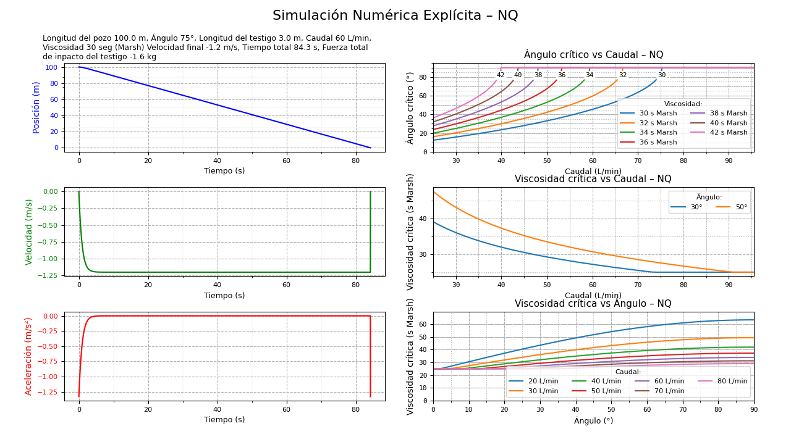
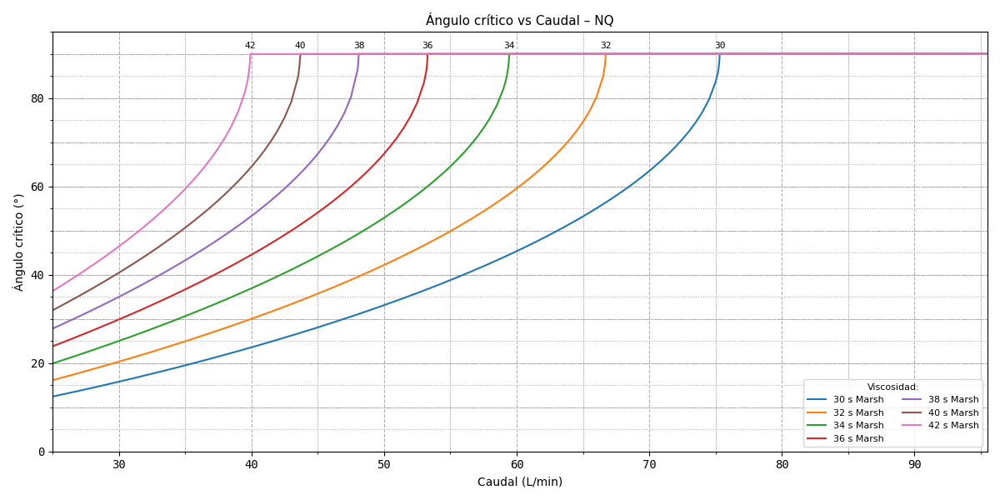

# Numerical Simulation of Core Descent in Upward Drilled Inclined Boreholes

This project develops a full numerical model of the dynamic behavior of a core sample descending inside an upward-inclined borehole.  
It rigorously considers the combined effects of gravity, buoyancy, drilling fluid drag, viscous shear, and simulates the core's movement using a **Runge–Kutta explicit integration scheme**.  
Additionally, it computes critical operational limits based on the drilling parameters.

---

## Geometrical and Physical Parameters

| Symbol | Meaning | Unit |
|:------|:--------|:----|
| $d_t$ | Core diameter | m |
| $d_b$ | Borehole internal diameter | m |
| $r_1 = \frac{d_t}{2}$ | Core radius | m |
| $r_2 = \frac{d_b}{2}$ | Borehole radius | m |
| $A_f = \pi r_1^2$ | Frontal area of the core | m² |
| $A_a = \pi (r_2^2 - r_1^2)$ | Annular flow area | m² |
| $A_{\text{lateral}} = 2 \pi r_1 L$ | Lateral surface of the core | m² |
| $V = A_f L$ | Core volume | m³ |
| $m = \rho_c V$ | Core mass | kg |

---

## Reference Axis and Sign Convention

- **Reference axis**: aligned with the borehole.
- **Positive direction**: upwards, following the borehole inclination.

| Force | Direction | Sign |
|:------|:----------|:----|
| Gravitational force $F_g$ | Downward along borehole | Negative |
| Buoyant force $F_b$ | Upward (buoyancy) | Positive |
| Viscous force $F_v$ | Opposite to relative motion | Depends on $v_{rel}$ |
| Drag force $F_d$ | Opposite to relative motion | Depends on $v_{rel}$ |
| Core descending motion | Downward along borehole | Negative velocity |
| Core ascending motion | Upward along borehole | Positive velocity |

---

## Borehole Inclination Definition

- $\theta > 0^\circ$: Borehole is **ascending** (upward inclined).
- $\theta = 0^\circ$: Borehole is **horizontal**.
- $\theta < 0^\circ$: Borehole is **descending** (natural fall by gravity).

The positive axis follows the borehole upwards.

---

## Governing Equations

The core's motion is governed by Newton's Second Law along the borehole axis:

  $m \ \frac{dV}{dt} = F_g + F_b + F_d + F_v$

where:

- $m$ = mass of the core kg
- $V$ = instantaneous velocity along the borehole m/s
- $F_g$ = gravitational force
- $F_b$ = buoyancy force
- $F_d$ = drag force due to relative motion against fluid
- $F_v$ = viscous wall shear force

---

## Forces Definitions

- **Gravitational Force**:

  $F_g = -m\ g\ \sin(\theta)$

- **Buoyant Force**:

  $F_b = \rho_f \ V \ g \ \sin(\theta)$
  
- **Drag Force**:

  $F_d = -\frac{1}{2} \ C_d \ \rho_f \ A_f \ v_{rel} \ |v_{rel}|$
  
- **Viscous Force**:

  $F_v = -\tau \ A_{\text{lateral}}$
  
Where:

- $\theta$ = borehole inclination angle $[^\circ]$
- $g$ = gravitational acceleration $[9.81 \ m/s^2]$
- $\rho_f$ = fluid density $[kg/m^3]$
- $C_d$ = drag coefficient (dimensionless)
- $v_{rel} = V - V_{fluid}$ = core velocity relative to the fluid

---
## Shear Stress Between the Pipe and the Core (Bingham Model)

The fluid flow between the pipe and the core generates a shear force that is determined from the Navier-Stokes equations, under static, incompressible, and axial conditions. The shear stress generated by the fluid on the core wall is:

  $\tau = \dfrac{4 \ \mu \ V_{fluid}}{r_1 \ (1 - (r_1/r_2)^2)}$

Where:

  $\mu$ = apparent dynamic viscosity $[Pa \cdot s]$

  $V_{fluid}$ = fluid velocity through the annular area $[m/s]$

---
Aquí tienes la traducción al inglés:

---

## Numerical Integration: Explicit Runge-Kutta Scheme

The integration is based on the **fourth-order Runge-Kutta method**:

  $V_{n+1} = V_n + \Delta t \left( \frac{\Delta V}{\Delta t} \right)_n$

  $X_{n+1} = X_n + \Delta t V_{n+1}$

#### Velocity and Position Update:

The velocity is updated as:

  $\Delta v = \dfrac{\Delta t}{6} \left( k_1v + 2k_2v + 2k_3v + k_4v \right)$

And the position is updated as:

  $\Delta x = \dfrac{\Delta t}{6} \left( k_1x + 2k_2x + 2k_3x + k_4x \right)$

Where:

- $\Delta t$ is the time step (adapted for numerical stability)
- $\Delta v$ is the change in velocity over $\Delta t$
- $\Delta x$ is the displacement over $\Delta t$
- $k_1$, $k_2$, $k_3$, and $k_4$ represent the approximations of acceleration and position at different intermediate steps.

Velocity stabilization is detected when the acceleration becomes smaller than a defined threshold.

---

## Critical Limit Calculations

The simulation computes critical conditions where the core may stop descending:

- **Critical viscosity vs flowrate** (fixed inclination)
- **Critical viscosity vs inclination** (fixed flowrate)
- **Critical inclination vs flowrate** (fixed viscosity)

These charts are essential for **drilling fluid design** and **borehole planning**.

---

## Requirements

- Python 3.8+
- NumPy
- Matplotlib

Install with:

```
pip install -r requirements.txt
```

---

## Example Use

```
input.json: // Comments are not valid in json file
{
  "NQ": {
    "longitud_testigo_m": 3.0,         // core sample length for simulation
    "longitud_pozo_m": 100.0,          // length of positive borehole for simulation
    "caudal_lpm": 60,                  // flow in lpm for simulation
    "viscosidad_marsh_seg": 30,        // Marsh viscosity for simulation
    "angulo_deg": 75,                  // Bore angle
    "rango_viscosidad": [30, 42, 2],   // Optional, multiple viscosities [start, end, increment]
    "rango_angulo": [30, 60, 20],      // Optional, multiple angles [start, end, increment]
    "rango_caudal": [20, 80, 10],      // Optional, multiple flow rates [start, end, increment]
    "densidad_roca_kgm3": 2200,        // Optional, core density default 2200 Kg/m3
    "densidad_fluido_kgm3": 1030,      // Optional, fluid density default 1030 Kg/m3
    "caudal_max_bombeo_lpm": 140,      // Optional, default 140 lpm, according with fluid pump
    "tiempo_max_simulacion_seg": 1000  // Optional, default 1000 seg
  }
  // you can add any number of different simulations
  ...
}
```
### Core position, velocity, acceleration vs time

```
python Simulacion.py input.json
```



**Simulation Result:**
- 100-meter well
- 75 degrees
- 3-meter core
- Q = 60 L/min
- 30 seconds (Marsh)

The core descends in 84 seconds, at an equilibrium velocity of -1.2 m/s, exerting a force of -1.6 kg upon reaching the bottom.


### Critical Marsh viscosity curves

```
python Simulacion.py --graficar_viscosidad input.json
```



- **Usage example:** With 40 L/min and a viscosity of 36 seconds (Marsh), wells with an inclination of 44.5 degrees or less should not be drilled, as the core will not descend.

---

## Marsh Funnel Conversion (Approximate Model)

The drilling fluid viscosity in field operations is typically measured in **Marsh seconds**, defined as the time required for a known volume to flow through a standard Marsh funnel.

The approximate conversion between Marsh seconds and dynamic viscosity (Pa·s) used in this project is:

  $\mu = \dfrac{1.1 \times (\text{Marsh Seconds} - 25)}{1000}$

Where:

- 25 seconds is the baseline drainage time of pure water at 25°C.
- 1.1 is a correction coefficient to approximate dynamic viscosity from empirical Marsh seconds.

Thus:

- A fluid with $35$ seconds Marsh time has an estimated viscosity of:

  $\mu \approx \dfrac{1.1 \times (35 - 25)}{1000} = 0.011 \, \ \ Pa \cdot s$

**Note:** This conversion is an engineering approximation and assumes Newtonian behavior for low-range Marsh readings, which may not be strictly valid for non-Newtonian drilling fluids.

---

## Special Cases Handled in the Code

- Fluid flow may push the core **upwards** if the annular flow velocity is sufficiently high.
- Reverse movement of the core (upward motion) is automatically detected.
- Dynamic forces (drag and viscous shear) switch signs based on the relative velocity $v_{rel}$.

The model thus supports:

- Normal descent (gravity-dominated)
- Decelerated descent (fluid resistance)
- Static equilibrium (core arrested)
- Reverse ascent (core uplift)

---

## Units Used Throughout

| Quantity | Symbol | Unit |
|:---------|:-------|:-----|
| Mass | $m$ | kg |
| Position | $X$ | m |
| Velocity | $V$ | m/s |
| Acceleration | $a$ | m/s² |
| Force | $F$ | N |
| Viscosity | $\mu$ | Pa·s |
| Fluid Density | $\rho_f$ | kg/m³ |
| Core Density | $\rho_c$ | kg/m³ |
| Gravitational Acceleration | $g$ | 9.81 m/s² |
| Marsh Viscosity | – | seconds (Marsh funnel) |
| Flow Rate | $Q$ | L/min |

---

# Final Notes

- The simulation was specifically designed for the analysis of **core retrieval** during **upward-inclined borehole drilling**.
- The code structure is optimized for **scientific exploration** and **operational analysis** in drilling engineering.
